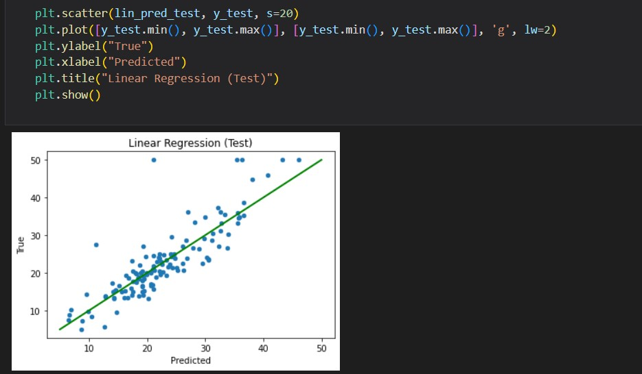
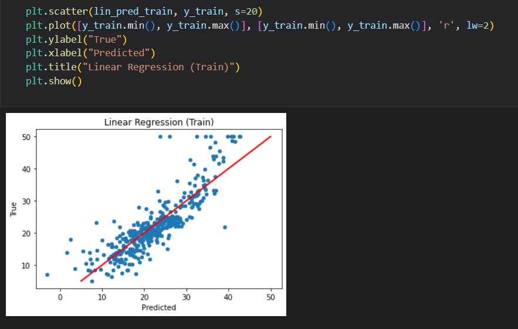
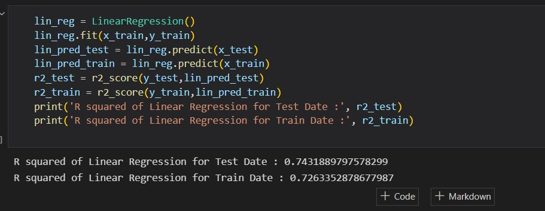

# Boston-House-Prediction-Linear-Regression
Project Description 📄

❄️ Built a linear regression model using scikit learn in boston data to predict 'Price' based on other dependent variable.

# Data :
    Number of Instances: 506

    :Number of Attributes: 13 numeric/categorical predictive. Median Value (attribute 14) is usually the target.

    :Attribute Information (in order):
        - CRIM     per capita crime rate by town
        - ZN       proportion of residential land zoned for lots over 25,000 sq.ft.
        - INDUS    proportion of non-retail business acres per town
        - CHAS     Charles River dummy variable (= 1 if tract bounds river; 0 otherwise)
        - NOX      nitric oxides concentration (parts per 10 million)
        - RM       average number of rooms per dwelling
        - AGE      proportion of owner-occupied units built prior to 1940
        - DIS      weighted distances to five Boston employment centres
        - RAD      index of accessibility to radial highways
        - TAX      full-value property-tax rate per $10,000
        - PTRATIO  pupil-teacher ratio by town
        - B        1000(Bk - 0.63)^2 where Bk is the proportion of blacks by town
        - LSTAT    % lower status of the population

   - Belsley, Kuh & Welsch, 'Regression diagnostics: Identifying Influential Data and Sources of Collinearity', Wiley, 1980. 244-261.
   - Quinlan,R. (1993). Combining Instance-Based and Model-Based Learning. In Proceedings on the Tenth International Conference of Machine Learning, 236-243, University of Massachusetts, Amherst. Morgan Kaufmann.
   
## Overview :
We have trained the model using simple Linear regression as the data was limited and required less pre processing

## Train Predicted vs Test Predicted :
<table>
  <tr>
    <td>For Train Data: Train vs Train_Predicted</td>
     <td>For Test Data: Test vs Test_Predicted</td>
  </tr>
  <tr>
    <td>
    <td>
  </tr>
 </table>
 <table>
  <tr>
    <td>Model Evaluation using R2 Score</td>
  </tr>
  <tr>
    <td></td>
  </tr>
 </table>
